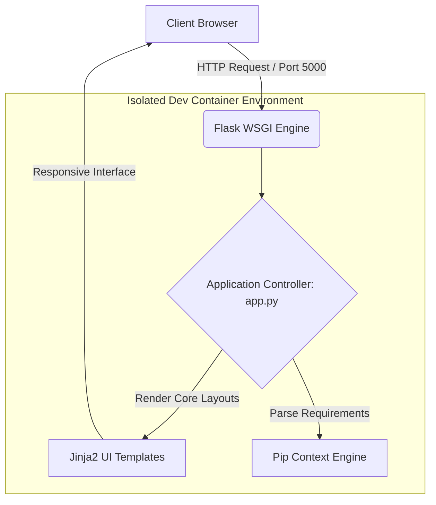

# 📸 Snap-Study

[](https://python.org)
[](https://palletsprojects.com)
[](https://visualstudio.com)
[](https://opensource.org)

An advanced, Dockerized **Python-based Web Application** powered by the **Flask** ecosystem. **Snap-Study** delivers a highly responsive, modern interface designed to streamline educational workflows, capture instant session snapshots, and optimize student asset management. 

---

## 📋 Table of Contents
- [🔍 System Architecture](#-system-architecture)
- [✨ Key Features](#-key-features)
- [💻 Core Tech Stack](#-core-tech-stack)
- [⚙️ Development Setup](#️-development-setup)
  - [Prerequisites](#prerequisites)
  - [Option A: Standard Local Installation](#option-a-standard-local-installation)
  - [Option B: Containerized Dev Environment](#option-b-containerized-dev-environment-recommended)
- [🚀 Execution & Usage](#-execution--usage)
- [🤝 Contributing Protocol](#-contributing-protocol)
- [📄 License](#-license)

---

## 🔍 System Architecture

The following diagram illustrates how requests flow from the Client UI down through the containerized Flask backend ecosystem:



---

## ✨ Key Features
* **Engineered Routing:** Thread-safe backend controllers built natively on Flask's WSGI interface.
* **Deterministic Isolation:** Standardized `.devcontainer` configuration ensures predictable dependency execution, eliminating "works on my machine" friction points.
* **Agile Package Orchestration:** Expressed package dependencies strictly bound inside `requirements.txt` for minimal deployment footprint.

---

## 💻 Core Tech Stack

| Layer | Component Technology | Purpose |
| --- | --- | --- |
| **Backend Engine** | Python 3.9+ / Flask | Core application control logic and routing orchestration. |
| **Containerization** | Docker / VS Code DevContainers | Isolated workspace mapping and strict environment control. |
| **Dependency Engine** | Pip Package Management | Standardized package synchronization matrix. |

---

## ⚙️ Development Setup

Choose either a direct local installation or a highly recommended containerized sandbox layout.

### Prerequisites
Before proceeding, verify that your host machine contains the following engineering configurations:
* **Python 3.9 or higher** (For local setups)
* **Docker Desktop Engine** & **VS Code Extension: Dev Containers** (For containerized sandboxes)

### Option A: Standard Local Installation

1. **Clone the Source Tree:**
   ```bash
   git clone https://github.com
   cd Snap-Study
   ```

2. **Initialize Isolated Virtual Runtime:**
   ```bash
   # Unix/macOS environments
   python3 -m venv venv
   source venv/bin/activate

   # Windows environment
   python -m venv venv
   .\venv\Scripts\activate
   ```

3. **Install Package Layers:**
   ```bash
   pip install --upgrade pip
   pip install -r requirements.txt
   ```

4. **Boot Up Application Thread:**
   ```bash
   python app.py
   ```

### Option B: Containerized Dev Environment (Recommended)

1. Open the repository root within **VS Code**.
2. When prompted by the system dialog in the bottom right corner, click **"Reopen in Container"**.
3. The DevContainer configuration engine will automatically instantiate the isolated environment, spin up the precise system configurations, and securely map runtime operations.

---

## 🚀 Execution & Usage

Once the local instance or DevContainer thread fires up completely, establish an connection interface via your browser endpoint:

```text
URL Destination: http://127.0.0
```

*For user interface documentation, place a functional screen recording or asset overview below:*


---

## 🤝 Contributing Protocol

We maintain a strict branching policy to keep the codebase healthy:

1. **Fork** the master repository.
2. Spin up a designated contextual branch: `git checkout -b feature/OptimalPerformance`
3. Commit structural modifications: `git commit -m 'feat: implement underlying performance enhancement'`
4. Forward the tracking reference: `git push origin feature/OptimalPerformance`
5. Generate an explicit **Pull Request** for manual peer review.

---

## 📄 License

This enterprise suite is made open-source under the strict terms of the **MIT License**. For complete parameters, review the standard `LICENSE` file within this codebase.
